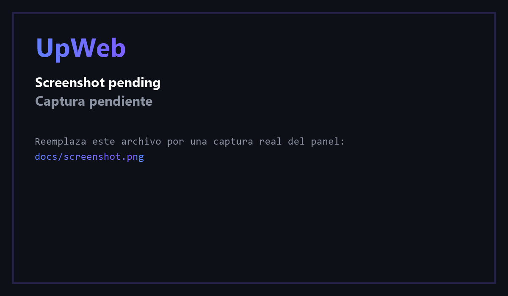

# UpWeb

[](https://github.com/danielmr2101/upWeb/actions/workflows/ci.yml)
[English](README.md)

Panel web local que levanta todos tus proyectos de desarrollo con un clic.

Si tienes muchos proyectos en `www` (Laragon u otro docroot) y te cansaste de recordar
qué comando corre en cada uno, este panel los detecta, los lista y los arranca.

```
http://localhost/upweb/
```



> La imagen de arriba es un placeholder: abre el panel, haz una captura y
> sobrescribe `docs/screenshot.png` — no hay que tocar el README.

---

## Qué hace

| | |
|---|---|
| **Levantar en un clic** | Detecta la arquitectura de cada carpeta y arranca los servidores recomendados. |
| **Logs en vivo** | Los eventos del servidor (SSE) transmiten la salida en tiempo real, con offsets en bytes para que las reconexiones no dupliquen ni pierdan datos. |
| **Estado en vivo** | Punto verde/rojo por servidor, URL detectada desde el log, errores mostrados en línea. |
| **Cualquier arquitectura** | Laravel, Flutter, Vite, Next, Angular, Nuxt, Astro, Django, Flask, FastAPI, Rails, Docker, PHP puro. |
| **Puertos ocupados** | Antes de arrancar comprueba si el puerto está libre y quién lo tiene; los conflictos se marcan en rojo. |
| **Favoritos y uso reciente** | Marca con estrella los proyectos que te importan; la lista pone los favoritos primero y después ordena por último uso. |
| **Comandos propios** | ¿Tu stack no está detectado? Agregas un comando y queda guardado. |
| **Puertos configurables** | Eliges el puerto por servidor; se recuerda entre sesiones. |
| **Servicios del sistema** | Apache, nginx, MySQL, Redis, Node, Docker, Flutter — quién está corriendo. |
| **Auto-abrir navegador** | Cuando un server queda listo, se abre la pestaña sola. |
| **Multiplataforma** | Windows, macOS y Linux para procesos, puertos y logs. |

---

## Requisitos

- PHP 8.1+
- Windows, macOS o Linux
- [Laragon](https://laragon.org) (o cualquier docroot; configura `www_root`)

Opcional, según tus proyectos: Node, Composer, Flutter, Python, Docker.

---

## Instalación

1. Copia esta carpeta dentro de tu docroot:

   ```
   C:\laragon\www\upweb
   ```

2. Recarga Laragon (o espera el auto-vhost) y abre:

   ```
   http://upweb.test
   ```

   También funciona con `http://localhost/upweb/`.

3. Listo. El panel escanea las carpetas hermanas y muestra cada proyecto con su tarjeta.

### Configuración

Los valores por defecto auto-detectan Laragon. Si tu instalación es distinta,
copia `config.local.php.example` a `config.local.php` (está en `.gitignore`) y ajústalo:

```php
<?php
return [
    'www_root'     => 'D:\\htdocs',
    'laragon_exe'  => 'D:\\laragon\\laragon.exe',
    'flutter_root' => 'C:\\flutter',
    'allow_remote' => false,
    'auth_token'   => null,
];
```

| Clave | Descripción | Por defecto |
|---|---|---|
| `www_root` | Carpeta que contiene los proyectos | carpeta padre de `upweb` |
| `laragon_exe` | Ruta a `laragon.exe` | `../laragon.exe` |
| `flutter_root` | SDK de Flutter (`FLUTTER_ROOT`) | auto-detección |
| `php_bin` / `npm_bin` / `node_bin` / `composer_phar` / `python_bin` | Binarios | auto-detección |
| `host_suffix` | Sufijo del vhost | `.test` |
| `hosts_file` | Archivo hosts que se consulta para detectar vhosts | hosts de Windows |
| `allow_remote` | Permitir acceso desde la red local | `false` |
| `auth_token` | Clave de acceso | `null` (no se exige) |

Todas las claves también pueden definirse como variables de entorno
(`UPWEB_WWW_ROOT`, `UPWEB_LARAGON_EXE`, `UPWEB_PHP_BIN`, `UPWEB_NPM_BIN`,
`UPWEB_NODE_BIN`, `UPWEB_COMPOSER_PHAR`, `UPWEB_PYTHON_BIN`, `UPWEB_FLUTTER_ROOT`,
`UPWEB_HOST_SUFFIX`, `UPWEB_HOSTS_FILE`, `UPWEB_ALLOW_REMOTE`, `UPWEB_AUTH_TOKEN`).
Las variables de entorno tienen prioridad sobre `config.local.php`.

> **Seguridad:** `api.php` solo responde a `127.0.0.1`/`::1`. Activar `allow_remote`
> (o `UPWEB_ALLOW_REMOTE=1`) además exige un `auth_token` configurado: sin él el
> acceso remoto sigue deshabilitado. Cuando hay token es obligatorio en **todas**
> las peticiones, también las locales, y `index.php` pide una pantalla de acceso.
> El panel ejecuta comandos en tu máquina: no lo expongas a internet.

---

## Uso

**Tarjeta de proyecto**

- **Levantar** — arranca los servidores recomendados para esa arquitectura.
- **Parar** — detiene todo lo del proyecto (solo aparece si algo corre).
- **Estrella** — marca el proyecto como favorito; los favoritos van primero y se
  pueden aislar con el filtro *Favoritos* del header.
- **Abrir .test** / **HTTPS** — abre el vhost de Laragon.
- **Carpeta** / **Terminal** — abre Explorer/Finder o una terminal en el proyecto.
- **+ Cmd** — agrega un comando personalizado.

**Servidor (fila dentro de la tarjeta)**

- **Iniciar** / **Detener** — control por servidor, con puerto editable.
- **Log** — salida en vivo del proceso (ahí ves los errores).

**Header**

- Chips de servicios (Apache, MySQL, Node, ...) con estado.
- **Buscar** y filtro **Favoritos**.
- **Laragon:** Iniciar / Reiniciar / Detener.
- **Auto-abrir** — abre el navegador cuando un server queda listo.
- **Detener todos los dev** — mata todos los procesos del panel.

---

## Arquitecturas detectadas

| Detección | Runner | Puerto |
|---|---|---|
| `artisan` | `php artisan serve` | configurable (8000) |
| `composer.json` → `scripts.dev` | `composer run dev` | auto |
| `package.json` → `dev`/`start`/`serve` | `npm run <script>` | según framework |
| `pubspec.yaml` + `lib/main.dart` | `flutter build web && php -S` / `flutter run` | 8080 |
| `manage.py` | `python manage.py runserver` | 8000 |
| `main.py` + FastAPI | `uvicorn main:app` | 8000 |
| `app.py` + Flask | `flask run` | 5000 |
| `bin/rails` | `bin/rails server` | 3000 |
| `docker-compose.yml` | `docker compose up` | auto |
| `index.php` / `index.html` | `php -S` | 8000 |

**Comandos personalizados** aceptan estos tokens:

```
{php} {npm} {flutter} {python} {composer} {host} {port} {log}
```

---

## Estructura

```
upweb/
├── .github/workflows/ci.yml   CI: tests en Linux, Windows y macOS + smoke test de navegador
├── .gitattributes             normaliza el fin de línea a LF
├── index.php              Shell UI + control de acceso
├── api.php                JSON API (solo localhost)
├── lib.php                Detección, procesos/puertos/logs, SSE
├── config.php             Valores por defecto + variables de entorno
├── config.local.php.example
├── assets/
│   ├── app.js             UI, cliente SSE, favoritos
│   ├── style.css
│   └── favicon.svg
├── docs/
│   └── screenshot.png     Captura del README (placeholder hasta que la reemplaces)
├── tests/
│   ├── run.php            Tests unitarios/integración (sin framework)
│   ├── auth_case.php      Subproceso usado por los tests de autenticación
│   ├── browser-smoke.js   Test extremo a extremo con Chrome headless
│   └── fixtures/          Proyectos falsos por arquitectura
└── storage/               Runtime (ignorado por git)
    ├── state.json         PIDs y puertos activos
    ├── custom.json        Comandos personalizados
    └── logs/              Salida de cada servidor
```

---

## API

Todas las respuestas: `{ "ok": true, "data": ... }` o `{ "ok": false, "error": "..." }`.

| `action` | Parámetros | Descripción |
|---|---|---|
| `list` | — | proyectos + runners + estado |
| `services` | — | servicios del sistema |
| `up` | `project` | arranca los runners recomendados |
| `start` | `project, id, port, host` | arranca un runner |
| `stop` | `project, id` | detiene un runner |
| `stop-project` | `project` | detiene todos los del proyecto |
| `stop-all` | — | detiene todo |
| `log` | `project, id, lines` | últimas líneas del log |
| `stream` | `project, id, from` | Flujo SSE del log desde el offset `from` |
| `open` | `target, value` | `url` / `folder` / `terminal` |
| `laragon` | `do=start\|stop\|restart` | controla Laragon (Windows) |
| `custom-add` | `project, label, command, port` | guarda comando propio |
| `custom-remove` | `project, customId` | borra comando propio |

`stream` emite eventos `data`, `offset` y `eof`, más `reset` cuando el offset pedido
está fuera de rango. Pasa `token` como parámetro de query si hay `auth_token`
(`EventSource` no puede enviar cabeceras).

---

## Tests

```bash
# Tests unitarios e integración (detección, puertos, árboles de procesos, auth)
php tests/run.php

# Test extremo a extremo en Chrome headless (render, favoritos, API, errores de consola)
node tests/browser-smoke.js
```

No hace falta framework de tests: `tests/run.php` es un script único y autocontenido.

Ambos se ejecutan en cada push mediante GitHub Actions: el primero en **Linux,
Windows y macOS**, el segundo en Linux con Chrome headless.

Variables de entorno que usa `tests/browser-smoke.js`:

| Variable | Para qué | Por defecto |
|---|---|---|
| `PHP_BIN` | Ejecutable PHP que sirve el panel | PHP de Laragon, luego `php` del `PATH` |
| `CHROME_BIN` / `CHROME_PATH` | Ejecutable Chrome/Chromium | rutas de instalación habituales, luego `PATH` |
| `SMOKE_PORT` / `SMOKE_CDP_PORT` | Puertos del panel y del protocolo DevTools | `9114` / `9333` |

---

## Roadmap

- [ ] Tema claro
- [ ] Editor de variables de entorno por proyecto
- [ ] Mostrar quién ocupa un puerto con un atajo para matarlo
- [ ] Los auxiliares exclusivos de Windows (control de Laragon, detección de vhosts)
      detrás de un indicador de capacidades

---

## Licencia

MIT — ver [LICENSE](LICENSE).
